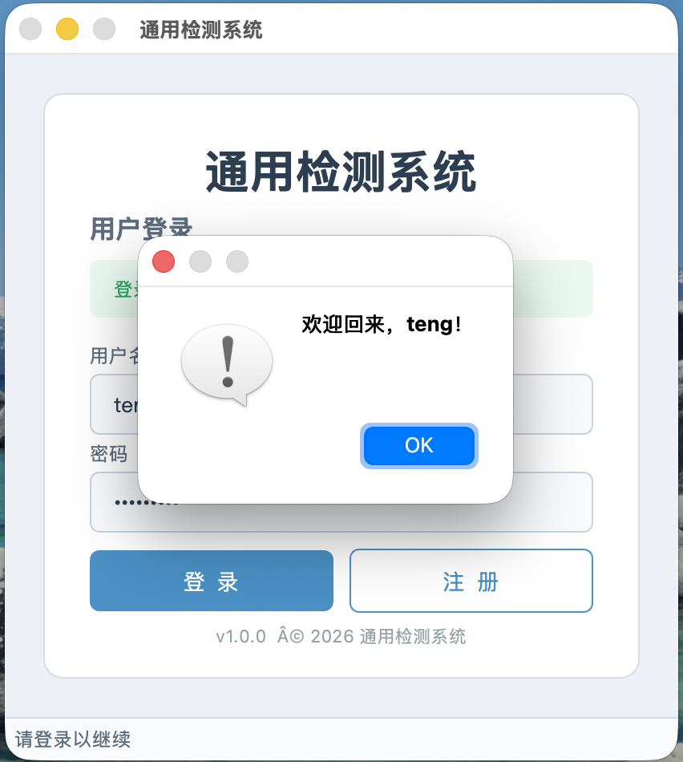
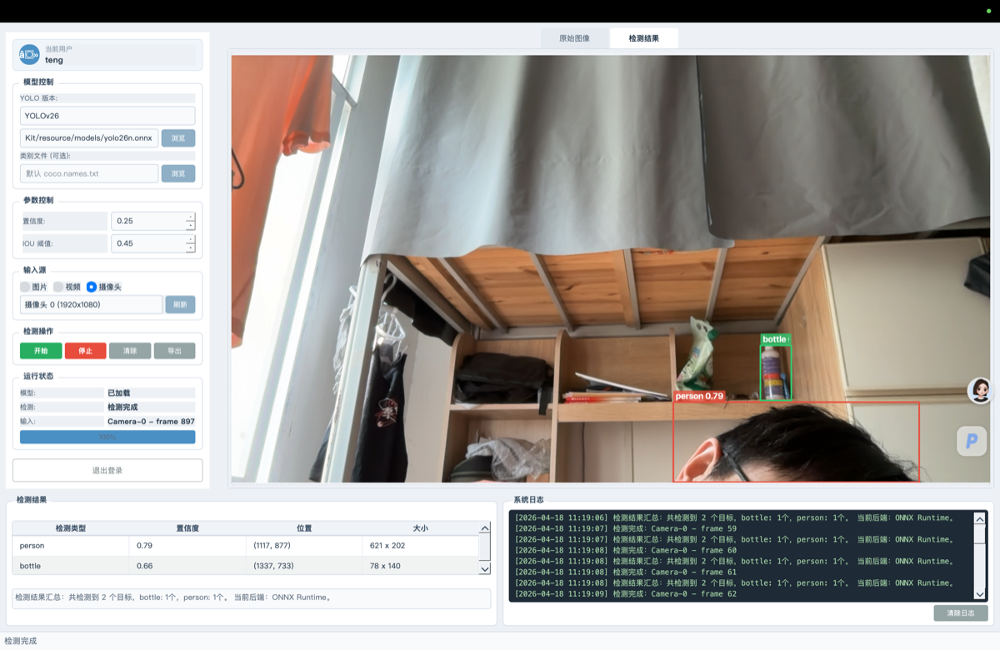

# IndustryVisionKit

基于 **C++17 / Qt6 / CMake** 的工业视觉检测桌面应用，支持 YOLOv5、YOLOv8、YOLO11、YOLO26 等多版本目标检测模型，提供**四种推理后端**（OpenCV DNN / ONNX Runtime / OpenVINO / LibTorch）运行时切换，支持图片、视频、摄像头三种输入模式。

## 截图预览

| 登录页 | 检测主页 |
|:---:|:---:|
|  |  |

## 功能特性

- 多版本 YOLO 模型推理（YOLOv5 / v8 / v11 / v26）
- **四种推理后端运行时切换**：OpenCV DNN、ONNX Runtime、OpenVINO、LibTorch
- 图片 / 视频 / 摄像头（含多设备选择、热插拔刷新）三种检测模式
- 实时视频流检测与标注
- 置信度、IOU 阈值实时调节
- 检测结果表格展示、汇总统计、CSV/TXT 导出
- 用户注册登录（本地 JSON 持久化）
- 运行日志实时输出
- 自定义类别标签文件支持

## 技术栈

| 组件 | 技术 |
|------|------|
| 语言 | C++17 |
| GUI 框架 | Qt6 Widgets（纯代码构建，不使用 .ui） |
| 构建系统 | CMake 3.21+ |
| 推理引擎 | OpenCV DNN（默认）/ ONNX Runtime / OpenVINO / LibTorch（可编译期选择） |
| 图像处理 | OpenCV 4.x |
| 模型格式 | ONNX (.onnx) / TorchScript (.torchscript) |

## 推理后端架构

项目采用**策略模式 + 独立编译单元**的多后端架构，每个后端一个 .cpp 文件，通过 CMake option 独立开关：

```
                    ┌─────────────────────────────────────────┐
                    │            YoloEngine（调度器）            │
                    │  preprocessImage() → 统一 letterbox+NCHW  │
                    └────────────────┬────────────────────────┘
                                     │ std::unique_ptr<InferenceBackend>
                    ┌────────────────┼────────────────────────┐
                    │                │                        │
              BackendOpenCV   BackendOnnxRuntime       BackendLibTorch
              cv::dnn::Net     Ort::Session           torch::jit::Module
              (默认，零依赖)    (需下载 SDK)            (需下载 SDK)
                    │                │                        │
                    └────────────────┼────────────────────────┘
                                     │
                              parseYoloOutput() → 统一后处理 + NMS
                                     │
                            QList<DetectionResult>
```

| 后端 | 文件 | 依赖 | 模型格式 | CMake 开关 |
|------|------|------|---------|-----------|
| **OpenCV DNN** | `BackendOpenCV.cpp` | OpenCV（已包含） | .onnx | 默认启用 |
| **ONNX Runtime** | `BackendOnnxRuntime.cpp` | onnxruntime SDK | .onnx | `INDUSTRYVISION_ENABLE_ONNXRUNTIME` |
| **OpenVINO** | `BackendOpenVINO.cpp` | OpenVINO SDK | .onnx | `INDUSTRYVISION_ENABLE_OPENVINO` |
| **LibTorch** | `BackendLibTorch.cpp` | LibTorch SDK | .torchscript | `INDUSTRYVISION_ENABLE_LIBTORCH` |

所有后端共享预处理（letterbox + NCHW + 归一化）和后处理（YOLO 格式解析 + NMS），仅推理调用分后端。

## 项目结构

```
IndustryVisionKit/
├── CMakeLists.txt                  # 根 CMake 配置（后端开关）
├── IndustryVisionLib/              # 算法层
│   ├── CMakeLists.txt              # 后端条件编译 + 链接
│   ├── include/IndustryVisionLib/
│   │   ├── DetectionTypes.h        # 检测数据结构与配置
│   │   ├── InferenceBackend.h      # 推理后端抽象接口
│   │   ├── UserManager.h           # 用户管理
│   │   └── YoloEngine.h            # YOLO 引擎（调度器）
│   └── src/
│       ├── BackendOpenCV.cpp       # OpenCV DNN 后端
│       ├── BackendOnnxRuntime.cpp  # ONNX Runtime 后端
│       ├── BackendOpenVINO.cpp     # OpenVINO 后端
│       ├── BackendLibTorch.cpp     # LibTorch 后端
│       ├── UserManager.cpp
│       └── YoloEngine.cpp          # 共享预处理/后处理 + 后端调度
├── IndustryVisionGUI/              # 界面层
│   ├── include/IndustryVisionGUI/
│   │   ├── ApplicationWindow.h     # 主窗口
│   │   ├── LoginWidget.h           # 登录/注册页
│   │   └── DetectionWidget.h       # 检测主页
│   └── src/
│       ├── main.cpp
│       ├── ApplicationWindow.cpp
│       ├── LoginWidget.cpp
│       └── DetectionWidget.cpp
├── resource/                       # 资源文件
│   ├── models/                     # 模型文件
│   ├── images/                     # 测试图片
│   └── classes/                    # 类别标签文件
├── bin/                            # 编译产物
│   ├── IndustryVisionKit           # 最终可执行文件
│   └── libIndustryVisionLib.a      # 算法层静态库（中间产物）
└── doc/
```

## 环境依赖

### 必需

| 依赖 | 最低版本 | 说明 |
|------|---------|------|
| CMake | 3.21+ | 构建系统 |
| Qt | 6.0+ | 需包含 Core、Gui、Widgets 模块 |
| OpenCV | 4.0+ | 需包含 core、imgproc、imgcodecs、video、videoio、highgui、dnn |
| C++ 编译器 | C++17 支持 | macOS Clang 15+ / GCC 9+ / MSVC 2019+ |

### 可选推理后端

| 依赖 | 说明 |
|------|------|
| ONNX Runtime 1.17+ | 通用 ONNX 推理，跨平台性能好 |
| LibTorch 2.0+ | PyTorch C++ 推理，支持 TorchScript 格式 |
| OpenVINO 2024+ | Intel 硬件优化推理（CPU/GPU/NPU） |
| Python 3.12 + ultralytics | 用于转换模型格式 |

## 安装与构建

### 1. 安装依赖

**macOS (Homebrew)：**

```bash
brew install qt opencv cmake

# ONNX Runtime — 从 GitHub Releases 下载
# https://github.com/microsoft/onnxruntime/releases
# 下载 onnxruntime-osx-arm64-*.tgz，解压到项目根目录

# LibTorch — 从 PyTorch 官网下载 C++ 发行版（CPU 版本）
# https://pytorch.org/get-started/locally/
# 下载 libtorch-macos-arm64-*.zip，解压到项目根目录
```

**Ubuntu (apt)：**

```bash
sudo apt install cmake qt6-base-dev libopencv-dev
# ONNX Runtime / LibTorch 需从官网下载预编译包
```

### 2. 准备模型文件

模型文件不包含在 Git 仓库中，请将模型放到 `resource/models/` 目录：

```bash
mkdir -p resource/models resource/images resource/classes
```

可用 Python + venv 一键导出模型（推荐使用 uv 管理隔离环境）：

```bash
# 安装 uv
curl -LsSf https://astral.sh/uv/install.sh | sh

# 创建虚拟环境
uv venv .convert_venv --python 3.12
source .convert_venv/bin/activate
uv pip install ultralytics onnx onnxslim

# 导出 ONNX 模型（OpenCV DNN / ONNX Runtime / OpenVINO 后端使用）
yolo export model=yolov5su.pt format=onnx
yolo export model=yolov8n.pt format=onnx
yolo export model=yolo11n.pt format=onnx
yolo export model=yolo26n.pt format=onnx

# 导出 TorchScript 模型（LibTorch 后端使用）
yolo export model=yolov5su.pt format=torchscript
yolo export model=yolov8n.pt format=torchscript
yolo export model=yolo11n.pt format=torchscript
yolo export model=yolo26n.pt format=torchscript

# 移动到 resource/models/
mv *.onnx *.torchscript resource/models/

deactivate
```

> `.convert_venv/` 已在 `.gitignore` 中排除。后续转换只需 `source .convert_venv/bin/activate` 复用。

### 3. 构建

根据需要启用对应后端：

```bash
# 仅 OpenCV DNN（零额外依赖，开箱即用）
cmake -S . -B build
cmake --build build -j$(nproc)

# 启用 ONNX Runtime
cmake -S . -B build \
  -DINDUSTRYVISION_ENABLE_ONNXRUNTIME=ON \
  -DINDUSTRYVISION_ONNXRUNTIME_ROOT=/path/to/onnxruntime

# 启用 LibTorch
cmake -S . -B build \
  -DINDUSTRYVISION_ENABLE_LIBTORCH=ON \
  -DINDUSTRYVISION_LIBTORCH_ROOT=/path/to/libtorch \
  -DCMAKE_PREFIX_PATH=/path/to/libtorch

# 同时启用多个后端
cmake -S . -B build \
  -DINDUSTRYVISION_ENABLE_ONNXRUNTIME=ON \
  -DINDUSTRYVISION_ONNXRUNTIME_ROOT=/path/to/onnxruntime \
  -DINDUSTRYVISION_ENABLE_LIBTORCH=ON \
  -DINDUSTRYVISION_LIBTORCH_ROOT=/path/to/libtorch \
  -DCMAKE_PREFIX_PATH=/path/to/libtorch

cmake --build build -j$(nproc)
```

**macOS 完整示例（Homebrew + 全部后端）：**

```bash
cmake -S . -B build \
  -DINDUSTRYVISION_ENABLE_ONNXRUNTIME=ON \
  -DINDUSTRYVISION_ONNXRUNTIME_ROOT=$(pwd)/onnxruntime-osx-arm64-1.24.4 \
  -DINDUSTRYVISION_ENABLE_LIBTORCH=ON \
  -DINDUSTRYVISION_LIBTORCH_ROOT=$(pwd)/libtorch \
  -DCMAKE_PREFIX_PATH=$(pwd)/libtorch

cmake --build build -j$(sysctl -n hw.ncpu)
```

### 4. macOS 运行注意事项

macOS 对第三方动态库有安全策略限制，LibTorch 的 dylib 可能被 Gatekeeper 拦截。如果遇到 `Library not loaded` 或 `code signature not valid` 错误，执行以下命令：

```bash
# 1. 移除隔离标记
xattr -d com.apple.quarantine libtorch/lib/*.dylib

# 2. 修正 libomp 绝对路径引用（LibTorch 编译时路径与本机不一致）
install_name_tool -change /opt/llvm-openmp/lib/libomp.dylib @rpath/libomp.dylib libtorch/lib/libtorch_cpu.dylib

# 3. 对动态库和可执行文件做 ad-hoc 签名
codesign --force --deep -s - libtorch/lib/*.dylib
codesign --force --deep -s - bin/IndustryVisionKit
```

> 项目已在 CMake 中配置了 `BUILD_RPATH`，正常情况下无需手动设置 `DYLD_LIBRARY_PATH`。

```bash
./bin/IndustryVisionKit
```

### 5. Linux / Windows 运行

```bash
# Linux — 需设置库路径
export LD_LIBRARY_PATH=/path/to/onnxruntime/lib:/path/to/libtorch/lib:$LD_LIBRARY_PATH
./bin/IndustryVisionKit

# Windows — 将 DLL 放到可执行文件同目录，或添加到 PATH
set PATH=C:\path\to\onnxruntime\lib;C:\path\to\libtorch\lib;%PATH%
IndustryVisionKit.exe
```

## 使用说明

1. **注册登录** — 首次使用先注册账号，用户信息保存在本地
2. **选择推理后端** — 左侧面板下拉框切换，支持 OpenCV DNN / ONNX Runtime / LibTorch（取决于编译时启用了哪些）
3. **选择模型** — 切换 YOLO 版本后自动匹配默认模型路径，也可手动浏览选择
4. **调整参数** — 置信度和 IOU 阈值实时生效
5. **选择输入源** — 图片/视频/摄像头模式，摄像头支持多设备探测与刷新
6. **开始检测** — 右侧显示原图和标注结果，下方表格展示检测详情
7. **导出结果** — 支持 CSV/TXT 格式导出

## YOLO 版本输出格式

| 版本 | 输出形状 | 说明 |
|------|---------|------|
| YOLOv5 | (1, 25200, 85) | 含 objectness 置信度 |
| YOLOv8/v11 | (1, 84, 8400) | 无 objectness，需转置 |
| YOLO26 E2E | (1, 300, 6) | 端到端格式，直接输出 [x1,y1,x2,y2,score,class] |

## 后续扩展

- [x] ~~多推理后端支持（OpenCV DNN / ONNX Runtime / OpenVINO / LibTorch）~~
- [ ] TensorRT 加速推理
- [ ] 实例分割模型支持（YOLOv8-seg 等）
- [ ] 多模型并发切换
- [ ] 检测历史记录与统计
- [ ] 目标跟踪（DeepSORT / ByteTrack）

## License

MIT License
